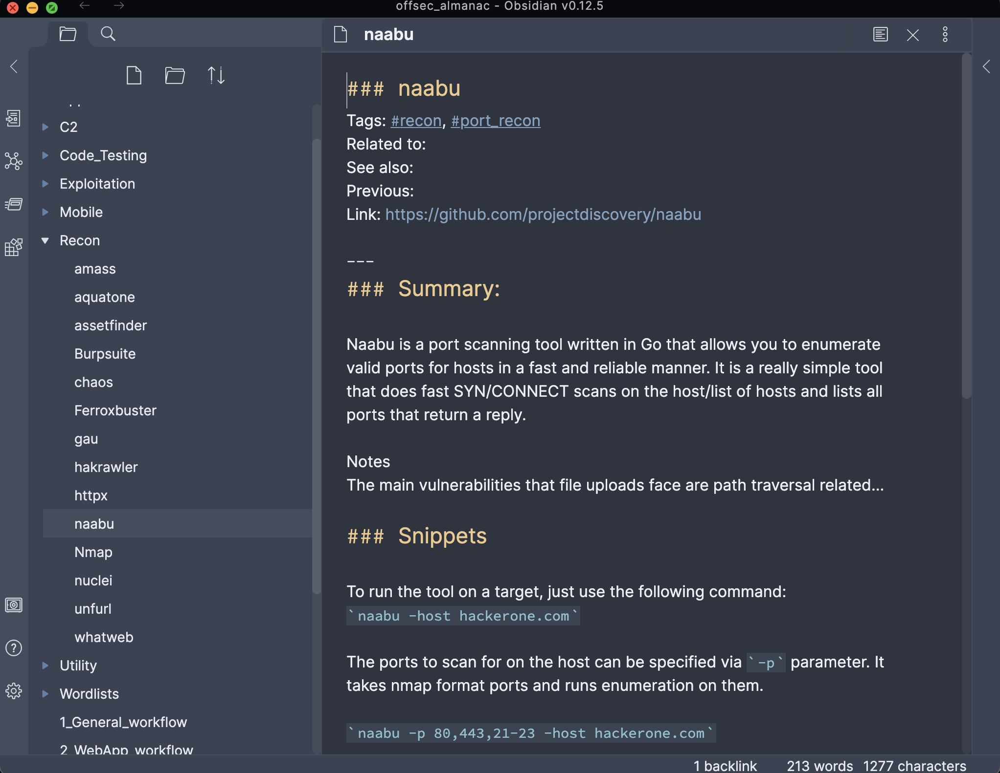

[![Contributors][contributors-shield]][contributors-url]
[![Forks][forks-shield]][forks-url]
[![Stargazers][stars-shield]][stars-url]
[![Issues][issues-shield]][issues-url]
[![MIT License][license-shield]][license-url]


<!-- PROJECT LOGO -->
<br />
<p align="center">
  <a href="https://github.com/hellor00t/offsec_almanac">
    
  </a>


  <h3 align="center">Offsec Almanac</h3>

  <p align="center">
     A collection of offensive security tools organized into categories based on workflow 
    <br />
    <a href="https://github.com/hellor00t/offsec_almanac"><strong>Explore the docs »</strong></a>
    <br />
    <br />
    <a href="https://github.com/hellor00t/offsec_almanac">View Demo</a>
    ·
    <a href="https://github.com/hellor00t/offsec_almanac/issues">Report Bug</a>
    ·
    <a href="https://github.com/hellor00t/offsec_almanac/issues">Request Feature</a>
  </p>
</p>


<!-- TABLE OF CONTENTS -->
<details open="open">
  <summary><h2 style="display: inline-block">Table of Contents</h2></summary>
  <ol>
    <li>
      <a href="#about-the-project">About The Project</a>
    </li>
    <li>
      <a href="#getting-started">Getting Started</a>
      <ul>
        <li><a href="#prerequisites">Prerequisites</a></li>
        <li><a href="#installation">Installation</a></li>
      </ul>
    </li>
    <li><a href="#usage">Usage</a></li>
    <li><a href="#roadmap">Roadmap</a></li>
    <li><a href="#contributing">Contributing</a></li>
    <li><a href="#license">License</a></li>
    <li><a href="#contact">Contact</a></li>
    <li><a href="#acknowledgements">Acknowledgements</a></li>
  </ol>
</details>


<!-- ABOUT THE PROJECT -->
## About The Project




Offsec Almanac is my humble attempt to glue together offensive security tools into a homogenous workflow that doubles as a handy tool specific reference.

This project started to solve the following problems:

* Print books are not searchable, they become outdated quickly and you cannot copy and paste code snippets which increases human error.
* Online only references cannot be accessed during periods where public internet is unavailable.
* Visually represent my workflow in order to identify areas of automation or tool coverage overlap
* Organize all my handwritten snippets, notes, stickies in such a way that someone could logically follow a workflow to meet an objective.

This repository will always be in draft mode as it is a living document.
<!-- GETTING STARTED -->
## Getting Started

To get a local copy up and running follow these simple steps.

### Prerequisites

[Obsidian](obsidian.md/) installed on your host. Alternatively you can open the repo with your favorite markdown editor if you don't wish to use the tag/graph feature of Obsidian.

### Installation

1. Clone the repo
   ```sh
   git clone https://github.com/hellor00t/offsec_almanac.git
   ```
2. Open Repo in [Obsidian](obsidian.md/) as a vault


<!-- USAGE EXAMPLES -->
## Usage

Workflows represent a general concept surrounding types of assessments. Workflows are meant to be the starting point for notes.

Each workflow will walkthrough steps or objectives of each engagement.

Example: General Workflow will take you from an IP/Domain into the next workflow depending on result

Folders are labeled as assessment objectives.  Within each objective are tools that can be used for that phase of the assesment. Where applicable subfolders are used to further categorize tools but not at the expense of folder depth/complexity.

Example: Recon folder will have tools for OSINT, Portscanning, webscraping etc

Specific tool usages are defined by tags.

Example: Nmap will have the tag #port_recon, #service_recon etc.

<!-- ROADMAP -->
## Roadmap

See the [open issues](https://github.com/hellor00t/offsec_almanac/issues) for a list of proposed features (and known issues).


<!-- CONTRIBUTING -->
## Contributing

Contributions are what make the open source community such an amazing place to be learn, inspire, and create. Any contributions you make are **greatly appreciated**.

1. Fork the Project
2. Create your Feature Branch (`git checkout -b feature/AmazingFeature`)
3. Commit your Changes (`git commit -m 'Add some AmazingFeature'`)
4. Push to the Branch (`git push origin feature/AmazingFeature`)
5. Open a Pull Request


<!-- LICENSE -->
## License

Distributed under the MIT License. See `LICENSE` for more information.


<!-- CONTACT -->
## Contact

Your Name - [@hellor00t](https://twitter.com/hellor00t)

Project Link: [https://github.com/hellor00t/offsec_almanac](https://github.com/hellor00t/offsec_almanac)


<!-- ACKNOWLEDGEMENTS -->
## Acknowledgements

* [README template](https://github.com/othneildrew/Best-README-Template)
* <div>Icons made by <a href="https://www.freepik.com" title="Freepik">Freepik</a> from <a href="https://www.flaticon.com/" title="Flaticon">www.flaticon.com</a></div>

<!-- MARKDOWN LINKS & IMAGES -->
<!-- https://www.markdownguide.org/basic-syntax/#reference-style-links -->
[contributors-shield]: https://img.shields.io/github/contributors/hellor00t/offsec_almanac.svg?style=for-the-badge
[contributors-url]: https://github.com/hellor00t/offsec_almanac/graphs/contributors
[forks-shield]: https://img.shields.io/github/forks/hellor00t/offsec_almanac.svg?style=for-the-badge
[forks-url]: https://github.com/hellor00t/offsec_almanac/network/members
[stars-shield]: https://img.shields.io/github/stars/hellor00t/offsec_almanac.svg?style=for-the-badge
[stars-url]: https://github.com/hellor00t/offsec_almanac/stargazers
[issues-shield]: https://img.shields.io/github/issues/hellor00t/offsec_almanac.svg?style=for-the-badge
[issues-url]: https://github.com/hellor00t/repo/issues
[license-shield]: https://img.shields.io/github/license/hellor00t/offsec_almanac.svg?style=for-the-badge
[license-url]: https://github.com/hellor00t/offsec_almanac/blob/master/LICENSE.txt